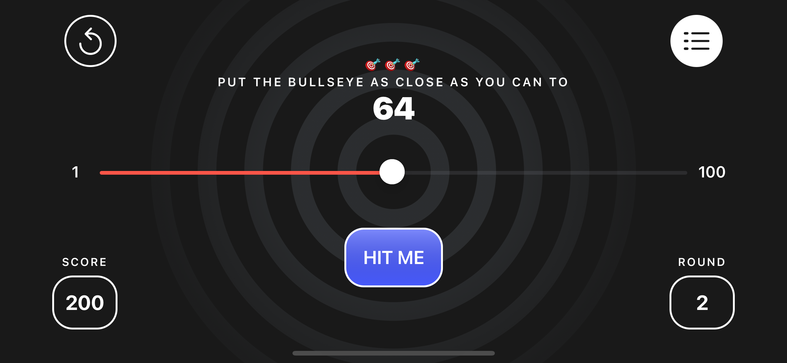
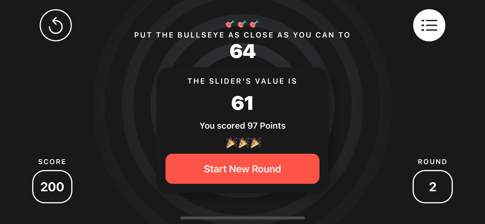
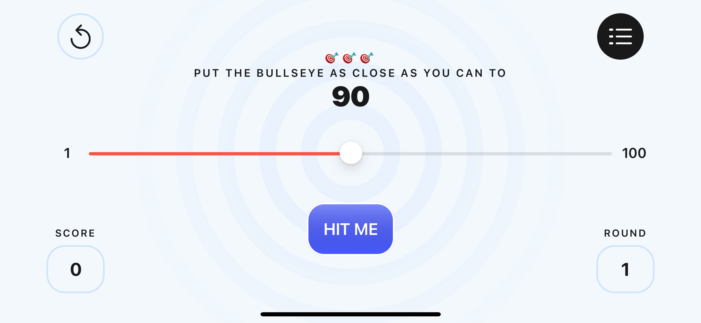
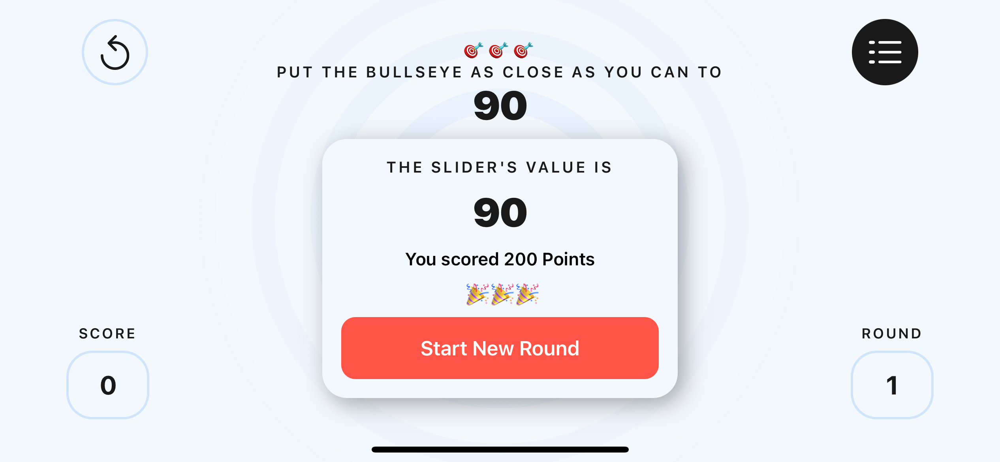

# Bullseye-SwiftUI

Created by following a Ray Wenderlich Swift introduction course.

This is a simple iOS game created with SwiftUI that involves trying to put a slider as close to a randomly generated number as possible. It involved referring to Figma for styling. A leaderboard is coming soon.

