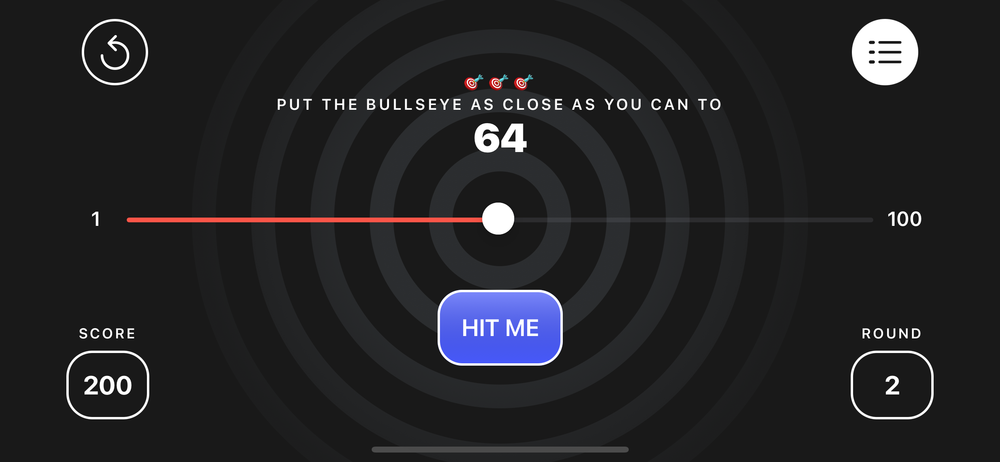
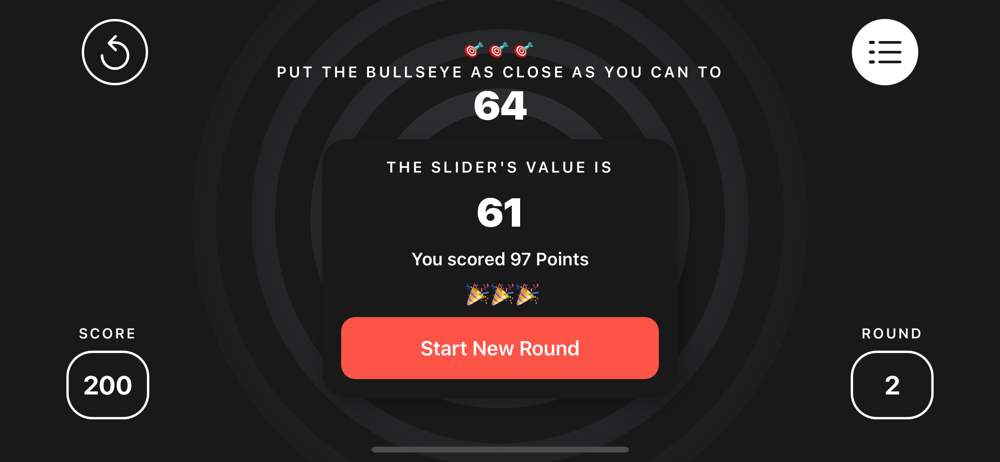
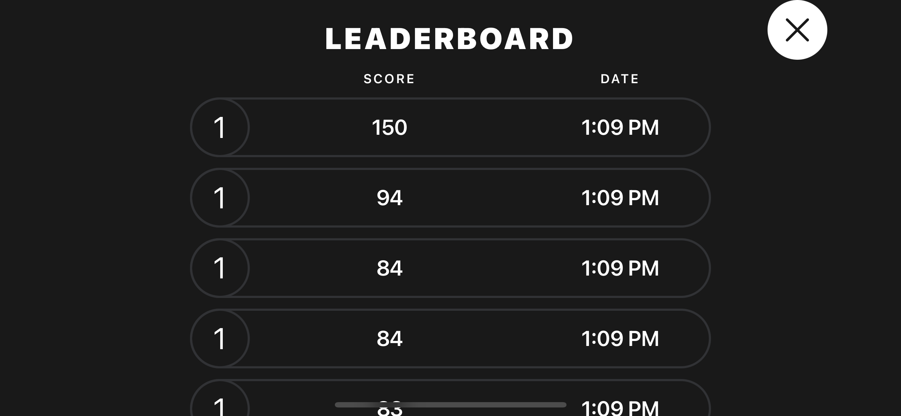
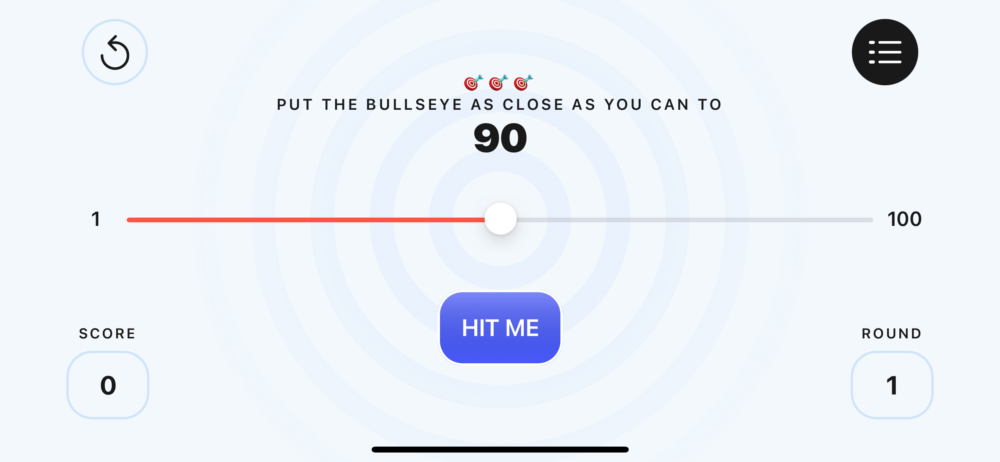
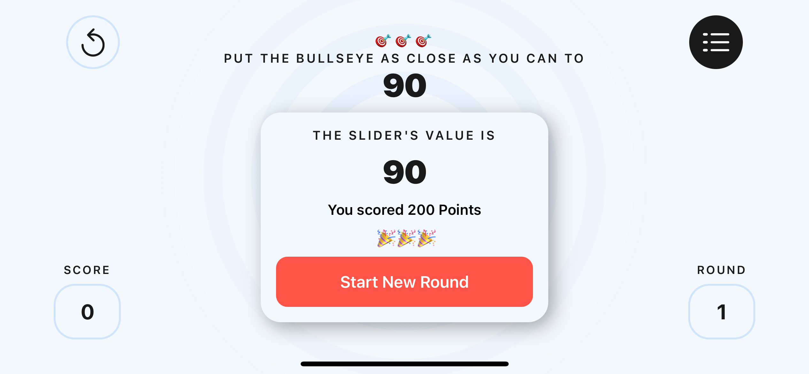
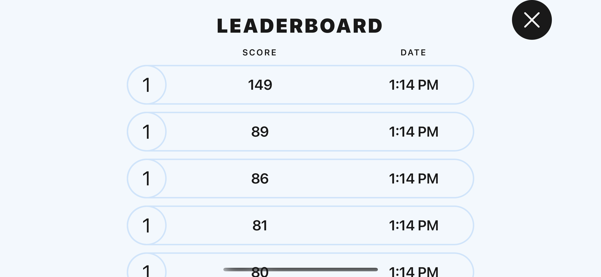

# Bullseye-SwiftUI

This was created by following a Ray Wenderlich course - [Introduction to Swift](https://www.raywenderlich.com/17493408-your-first-ios-and-swiftui-app-an-app-from-scratch)

This is a simple iOS game created with SwiftUI that involves trying to put a slider as close to a randomly generated number between 1-100 as possible. It involved referring to Figma for styling. It keeps track of round and score, has a leaderboard, and has the ability to reset.

### Dark Mode
Main Screen

Alert

Leaderboard

### Light Mode
Main Screen

Alert

Leaderboard

